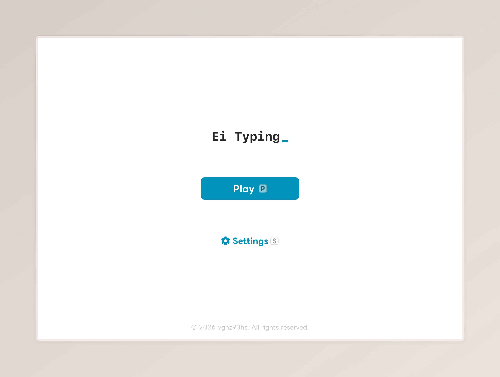
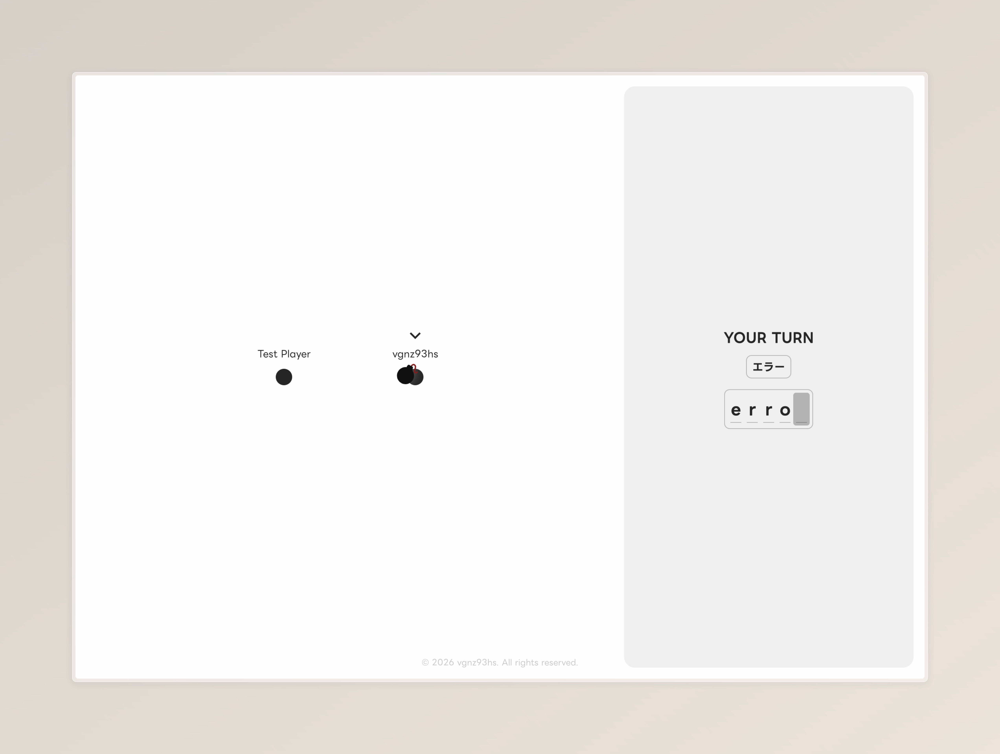

# Ei-Typing

## Overview

Ei-Typing is a real-time multiplayer typing game built with Next.js, Node.js, and Socket.IO.

## How to Play

**Playing on a PC is strongly recommended.**

1. Visit [ei-typing.vgnz93hs.com](https://ei-typing.vgnz93hs.com)
2. Choose a display name.
3. Click **Join** to enter the room.
4. Wait for other players to join.
5. Type the displayed Japanese word in English as fast as possible.
6. Once you finish typing, the bomb will be passed to another player.
7. Keep passing the bomb before it explodes.
8. The player holding the bomb when it explodes loses the game.

## Tech Stack

### Frontend

- Next.js
- React
- TypeScript
- Tailwind CSS

### Backend

- Node.js
- Express
- Socket.IO

### Deployment

- Vercel: [ei-typing.vgnz93hs.com](https://ei-typing.vgnz93hs.com)
- Render: [ei-typing.onrender.com](https://ei-typing.onrender.com)
