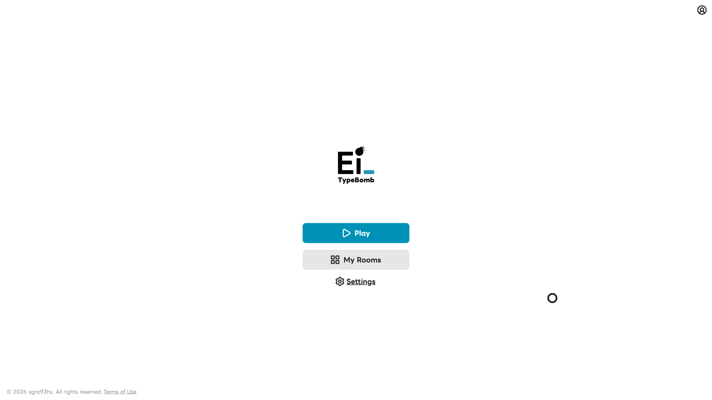
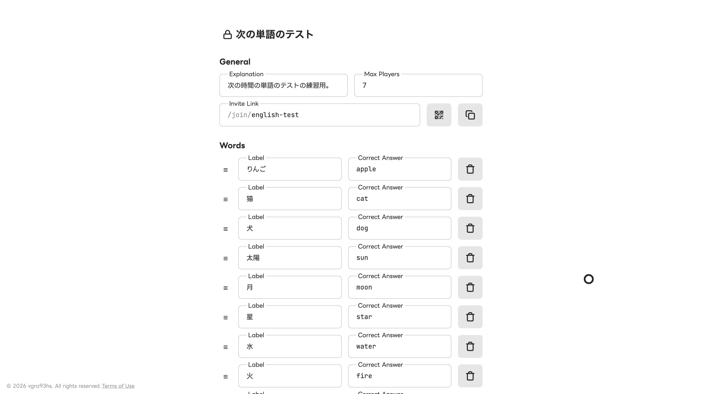
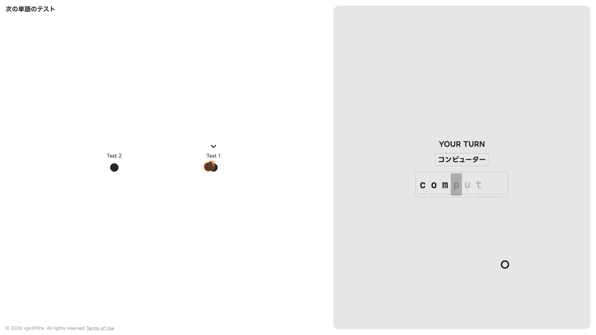

# Ei-TypeBomb

Ei-TypeBomb is a real-time multiplayer typing game built with Next.js, Node.js, and Socket.IO.

Players join a shared room and pass a virtual bomb by correctly typing the displayed English word. The game is designed around a simple real-time game loop, with the server managing the game state and clients rendering the current state.

## Features

- Real-time multiplayer gameplay
- Room-based game sessions
- Custom word sets
- JSON import / export for word sets
- Password-protected rooms
- Spectator mode
- JWT-based room authentication
- Responsive UI
- Background music and sound effects
- Primary / backup server failover
- Server-side game state management
- Persistent server logging

## Architecture

Ei-TypeBomb consists of a Next.js client and a Node.js server communicating through Socket.IO.

```text
┌─────────────────────┐
│       Next.js       │
│ React / TypeScript  │
└──────────┬──────────┘
           │
       Socket.IO
           │
           ▼
┌─────────────────────┐
│       Node.js       │
│ Express / Socket.IO │
├─────────────────────┤
│ Room Management     │
│ Game State          │
│ Turn Management     │
│ Bomb Timer          │
│ Authentication      │
└──────────┬──────────┘
           │
           ▼
      Room Data
```

The client does not independently determine the outcome of a game. The server maintains the authoritative game state and broadcasts state changes to connected clients.

## Game State

Each active game maintains its state on the server.

Important state includes:

- `gameId` — identifies the current game instance
- `isStart` — whether the game is running
- `bombHolder` — index of the player currently holding the bomb
- `wordIndex` — current word
- `bombStatus` — current bomb state
- `bombTimer` — timer controlling the bomb
- `users` — players currently participating in the game

A unique `gameId` is generated when a game starts.

Asynchronous timers check the current `gameId` before modifying the room. This prevents timers belonging to an older game from affecting a newer game.

## Room Management

Ei-TypeBomb distinguishes between Socket.IO room membership and game-room membership.

A socket can remain connected to the Socket.IO room while its player is removed from the current game.

This allows the application to handle game lifecycle and network connections separately.

Room creation also uses a pending-load map to prevent multiple simultaneous requests from creating duplicate room instances.

```text
Request
   │
   ▼
Room exists? ── Yes ──> Use existing room
   │
   No
   │
   ▼
Pending load exists? ── Yes ──> Reuse Promise
   │
   No
   │
   ▼
Load room data
   │
   ▼
Create in-memory room
```

## Game Flow

A typical game follows this sequence:

```text
Create / load room
        │
        ▼
   Join players
        │
        ▼
    Start game
        │
        ▼
 Select initial player
        │
        ▼
 Display word
        │
        ▼
 Player types word
        │
        ▼
    Word correct
        │
        ▼
 Pass bomb to next player
        │
        ├───────────────┐
        │               │
        ▼               ▼
 Continue game      Bomb explodes
                        │
                        ▼
                   End game
```

The bomb duration is randomized for each cycle, preventing players from relying on a fixed timer.

## Client-side Connection Handling

The client supports a primary server and a backup server.

Both connections can be initialized while the client waits for the primary server to become ready. If the primary server does not become available within the configured timeout, the backup server is selected.

```text
Primary Server
      │
      ├── Ready ────────> Use Primary
      │
      └── Timeout
             │
             ▼
       Backup Server
```

The active socket is tracked on the client so that events from a socket that was not selected cannot update the application state.

## Authentication

Room access uses a JWT-based authentication flow.

```text
Client
  │
  │ auth:response
  │ JWT + display name
  ▼
Server
  │
  │ verify token
  ▼
Room identification
  │
  ▼
Socket.IO room
```

The server verifies the token before associating a socket with a game room.

## Word Sets

Word sets are represented as JSON data containing Japanese and English word pairs.

Example:

```json
[
    {
        "jp": "りんご",
        "en": "apple"
    },
    {
        "jp": "猫",
        "en": "cat"
    }
]
```

Room owners can import and export word sets, allowing custom vocabulary to be used in games.

## Reliability

The server includes several mechanisms intended to keep asynchronous game state consistent:

- Unique game IDs for game generations
- Explicit timer cleanup
- Validation of the current game before timer callbacks modify state
- Protection against duplicate room creation
- Separation of Socket.IO and game-room membership
- Primary / backup server selection
- Validation of client-supplied game events on the server

The server treats client events as requests rather than trusted state changes. For example, a `word:success` event is accepted only when the sender is the player currently holding the bomb.

## Logging

Server-side events are logged with structured information such as:

- Event category
- Room ID
- Game ID
- Socket ID
- User ID
- Display name
- Player transitions
- Game lifecycle events
- Errors

This makes it possible to trace game and server events when debugging production issues.

## Technology Stack

### Client

- Next.js
- React
- TypeScript
- Tailwind CSS

### Server

- Node.js
- Express
- Socket.IO
- TypeScript

### Authentication / Data

- Supabase
- JWT

### Analytics

- PostHog

### Deployment

- Vercel
- Mac mini
- Cloudflare Tunnel
- Render

## Project Structure

```text
Ei-TypeBomb/
├── client/
│   ├── app/
│   │   ├── (editor)/
│   │   └── (game)/
│   ├── components/
│   ├── lib/
│   └── type/
│
├── server/
│   └── src/
│       ├── index.ts
│       ├── lib/
│       └── type.ts
│
└── docs/
    └── screenshots/
```

## How to Play

1. Open the game.
2. Choose a display name.
3. Join a room.
4. Wait for other players.
5. Type the English translation of the displayed Japanese word.
6. Correctly typing the word passes the bomb to the next player.
7. Keep passing the bomb before it explodes.
8. The player holding the bomb when it explodes loses.

> Playing on a PC is strongly recommended.

## Screenshots







## License

This project is licensed under the MIT License.
