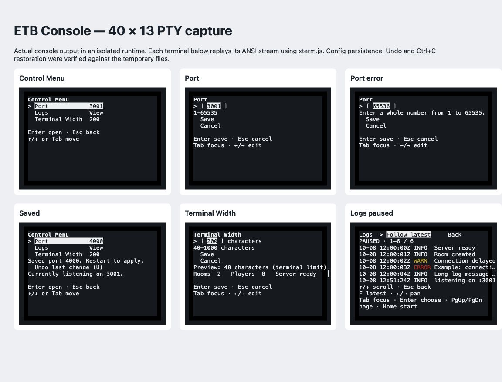

# Control Menuの再設計と評価

設計基準: [Apple Human Interface Guidelines](https://developer.apple.com/design/human-interface-guidelines)。
外観の模倣ではなく、設定の確認・変更・取り消しとログ閲覧に適用した。
UIの言語は既存の英語に合わせた。

## 現状評価（変更前のコードと40×12のANSI描画）

既存実装にも項目と値の整列、直接編集、Tab、Esc、入力検証は存在した。
改善対象は次の操作上の問題である。

- 操作案内を端末の最下部へ固定し、設定内容と操作の距離が大きい。
- フォームの詳細がアクションより先に並び、短い画面でSave/Cancelが隠れる。
- 幅のプレビューが54文字の線で頭打ちになり、設定の違いを確認しにくい。
  設定済みの幅で画面を制限するため、より広い幅も実際には試せない。
- 保存結果が一覧・環境変数の説明より後に置かれ、短い画面で見えなくなる。
- Dashboardの入口はCのみ。マウスは設定項目だけに対応している。
- ログが直近128 KiBに限られ、Homeでファイルの先頭へ戻れない。
- ログの長い行が無印で切れ、横に続きがあると気づきにくい。

## 画面構造

| 画面 | 何ができるか / 次の操作 | 戻る・失敗からの復帰 | 結果・説明の優先順位 |
| --- | --- | --- | --- |
| Dashboard | Control MenuのボタンとEnter/Tab/C案内 | メニューからEscで復帰 | ゲーム情報は維持 |
| Control Menu | Port / Logs / Terminal Widthと現在値。矢印/Tab→Enter、クリック | EscでDashboard。Uで最後の保存を取り消す | 保存結果とUndoを詳細説明より優先。短い画面は選択項目だけ表示 |
| Port | 名前→現在値の全選択→許可範囲→Save/Cancel | Escで破棄。無効値は修正内容を表示し全選択。保存失敗は内容保持 | 保存後に値と再起動の必要性を表示。PORT優先時は必要な画面で表示 |
| Terminal Width | 現在値（characters）、許可範囲、Save/Cancel、実幅のサンプル | Portと同じ操作 | 保存後すぐ反映。プレビューは物理幅以下。端末上限を明示 |
| Logs | UTCタイムスタンプ、文字の重要度、LIVE/PAUSED、行範囲、Follow/Back | Esc/QまたはBackで一覧。F/End/Followで最新へ | ログが主領域。スクロール・ページ・横移動。切れた行に「…」 |

設定画面は最大54文字の内容領域に収め、操作案内を内容の直後に置く。
設定値で設定画面自体を狭めず、Dashboardとログの描画幅へ適用する。
選択は「>」とANSI反転、状態はLIVE/PAUSEDやERROR/WARNの文字で示し、色だけに頼らない。
反転は端末の前景・背景を使うのでライト/ダークの設定に追従する。
マウスの対象と描画は同じレイアウト計算を共有し、余白はクリック対象に含めない。
入力欄のクリックはカーソルを移動し、Save/Cancel、Undo、ログのFollow/Backも操作できる。

## 操作数と遷移数

初期選択がPortの場合。通常キーを1回として数え、数字も各文字1回とする。
途中のTab/矢印の数は選択位置による。保存でメニューへ戻るところまでを計測する。

| タスク | キー | 入力数 | 画面遷移数 |
| --- | --- | ---: | ---: |
| Portを4000に変更 | Enter、Enter、4 0 0 0、Enter | 7 | 3 |
| 幅を100に変更 | Enter、Tab、Tab、Enter、1 0 0、Enter | 8 | 3 |
| 編集を破棄 | メニューからEnter、Esc | 2 | 2 |
| 最後の保存を取り消す | メニューでU | 1 | 0 |
| ログを開き戻る | Enter、Tab、Enter、Esc | 4 | 3 |
| ログの追従を再開 | ログでF | 1 | 0 |
| 無効なPortを4000へ修正 | エラー表示後4 0 0 0、Enter | 5 | 1 |
| 保存失敗を再試行 | 権限などの原因修正後Enter | 1 | 成功時1 |

保存までのキー数自体は従来と同等。改善は入口の発見、保存結果の可視性、
操作の一貫性、修正時の全選択、保存取り消しの追加にある。

## 検証

- 自動テスト: 数値境界、全選択・部分編集、保存失敗、キャンセル、Undo、ログのTab操作。
- 画面: 24×10、40×12、80×24と極小サイズ。全行の表示幅と高さ、Unicode、
  ANSI制御の除去、マウス対象と表示の一致、短い画面での保存通知を確認。
- ログ: 5000件、128 KiB超のファイルの先頭・中間・末尾、追加中の停止、再追従、
  切り詰め・ローテーション、空/未作成ファイル、256 KiB超の1レコードを確認。
  行境界だけを索引化し、本文はページ単位で非同期読み込みする。
- 極端に短い端末では説明やボタンを省略し、入力・選択項目とEnter/Escの案内を優先する。
  1列×1行で全ラベルを読めることまでは保証しない。

スクリーンリーダー互換性や初見ユーザーによる実験は未検証。
マウスはSGR mouse対応端末で使用でき、全操作にキーボード経路がある。
巨大ログの最初の索引作成にはファイルサイズに応じた時間と行数に比例するメモリが必要。
本文の全件読み込みは行わず、読み込みは非同期なのでゲームのイベントループをブロックしない。

## 実描画の確認結果

隔離した実コンソールを40列×13行のPTYで起動し、15状態のANSI出力を取得。
ゲームサーバーや実際の設定ファイルには接続せず、一時ファイルでPort/幅の保存、
Undo、クリック、ログの停止・復帰、Ctrl+Cによるマウス/カーソル/画面の復元を確認した。
取得したストリームをxterm.jsで再生して目視確認した画像を以下に示す。
ログの内容は検証用のサンプルである。

確認結果: 選択領域が項目の幅に収まり、保存通知とUndoが読める。
Portのエラー修正案内、幅の物理端末上限、WARN/ERRORの文字と色、
PAUSEDと行番号、切れた行の「…」を確認した。
操作案内は設定内容の直後にあり、ログでは本文の下に配置される。

最終チェック: サーバーの69テスト、`npm run typecheck`、`npm run build`に成功。
